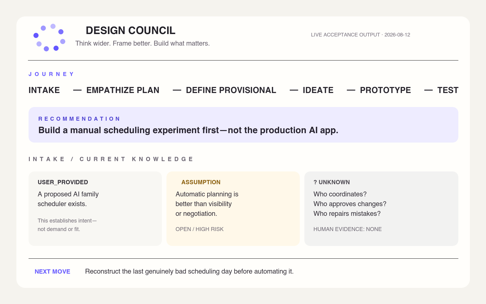
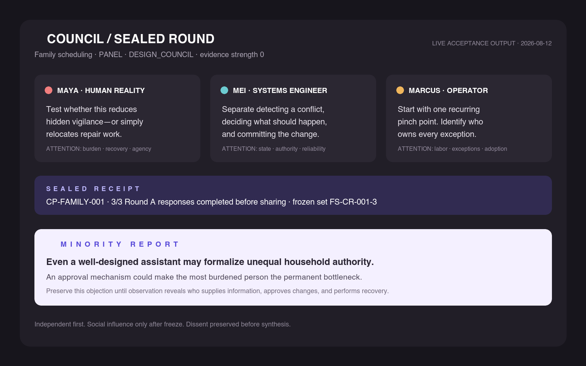
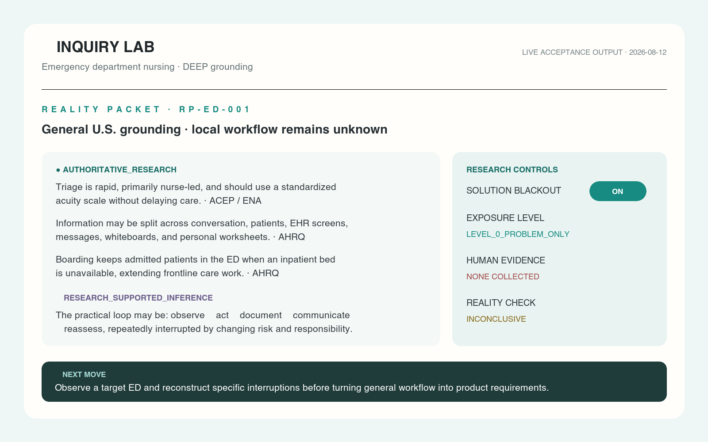
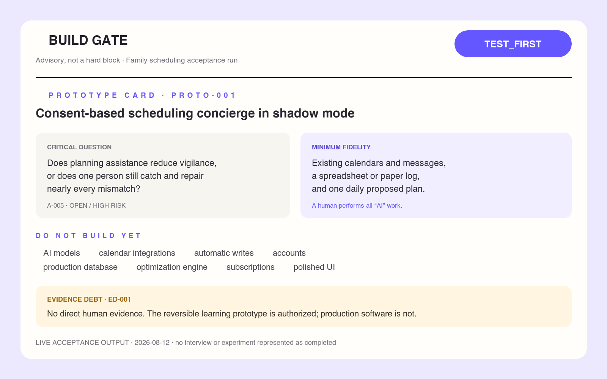
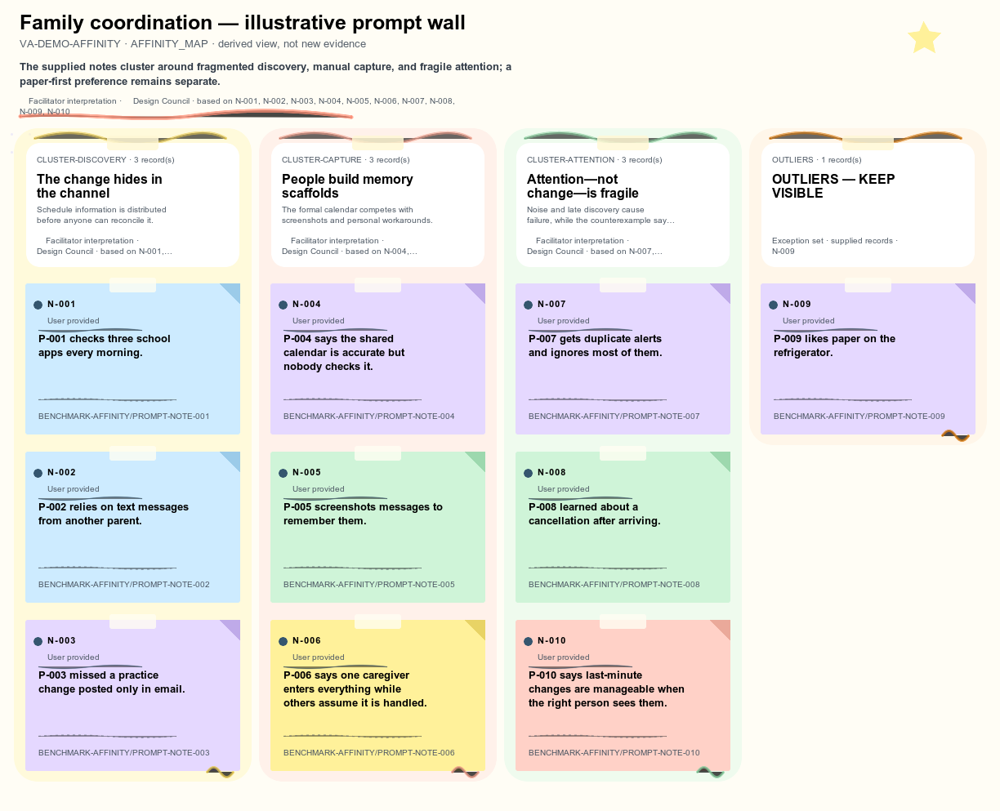
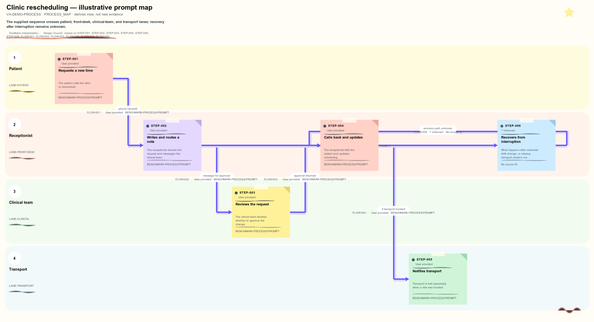

# ◇ MightShape

**Think wider. Frame better. Build what matters.**

MightShape is one human-centered design product packaged for OpenAI Codex/ChatGPT and Claude Code, with optional self-hosted workshop transports for Slack, Discord, and Microsoft Teams. It helps a team keep the energy of “let’s build it” while determining whether the proposed solution addresses the right human problem.

The name reflects the product's working rhythm: **might** keeps competing possibilities open;
**shape** turns human evidence into better frames, experiments, and things worth building. It is a
product name—not a claim that formal trademark clearance has been completed.

It is more than a prompt pack:

- an adaptive **Empathize ⇄ Define ⇄ Ideate ⇄ Prototype ⇄ Test** engine, with a lightweight Intake layer;
- ten persistent fictional collaborators with complete lives, bounded expertise, contradictions, recognizable voices, and project memory;
- sealed independent generation before cross-pollination, challenge, Minority Report, and synthesis;
- an Inquiry Lab for Reality Packets, research-grounded synthetic people, story-first interviews, real Bring-Your-Own participant studies, and synthetic-to-human Reality Checks;
- strict evidence provenance, revisioned project state, Assumption Burn-down, Design Debt, Evidence Debt, and an advisory Build Gate;
- optional participatory exercises with an adaptive AI facilitator for people who do not already know Design Thinking; and
- a portable, playful Visual Workbench for evidence-linked affinity walls and process maps, plus an inspectable workshop trace that shows real method outputs as they develop.

The core works without a hosted service, custom MCP server, external database, or required hook.

## The journey

```text
                         ◇ MIGHTSHAPE
                              INTAKE
                                │
        EMPATHIZE ⇄ DEFINE ⇄ IDEATE ⇄ PROTOTYPE ⇄ TEST
             ▲          ▲        ▲          ▲          │
             └──────────┴────────┴──────────┴──────────┘
                                │
                          ◆ BUILD GATE
```

Testing can send a project backward. That is learning, not failure. Straightforward requests such as “implement the toggle in issue.md” route directly to implementation instead of forcing a workshop.

## Signature behavior

**The Council.** Maya, Leo, Priya, Marcus, Elena, Theo, Samira, Jack, Mei, and Rafael are shared byte-for-byte across both platform packages. Consequential rounds use a common packet, isolated first responses, a frozen set, anonymous cross-pollination, forced mutation, convergent challenge, a named **◇ MINORITY REPORT**, and synthesis that never invents consensus.

**Inquiry Lab.** Consequential synthetic inquiry starts with authoritative research and a Reality Packet—not “pretend you are a nurse.” Synthetic participants separate domain grounding, reasonable inference, constructed continuity, and unknowns. They can say “I don’t know,” and their output never becomes human evidence.

**Evidence Firewall.** Every meaningful claim retains provenance such as `HUMAN_INTERVIEW`, `AUTHORITATIVE_RESEARCH`, `SYNTHETIC_PRACTITIONER`, `DESIGN_COUNCIL`, `ASSUMPTION`, or `UNKNOWN`. Confidence and evidence strength are stored separately.

**Participatory exercises.** At a useful exercise boundary, MightShape offers a compact, non-blocking choice: **Watch · Collaborate · One prompt at a time**. Watching remains the default, so work continues if the user does not choose. A joining user can contribute ideas, sort notes, reconstruct a process, map assumptions, shape POVs/HMWs, or design a prototype/test. The facilitator defaults to **novice-assisted** support unless fluency is evident, with **guided** and **light-touch** levels available at any time. It explains the immediate purpose and mindset, gives one method-safe example, and asks one bounded question—not a lecture or giant questionnaire. Before independent ideation, that example uses only an answer shape or distant domain so it does not seed the user's first idea.

**Open Studio.** Substantial sessions show conclusion-level checkpoints, working cards, idea batches, groupings, mutations, exceptions, and outliers at meaningful boundaries. In `WORKSHOP`, each material boundary is inspectable as `INPUTS → TRANSFORMATION → OUTPUT → WHAT CHANGED → NEXT`. Compact mode keeps routine work lean. The trace exposes method artifacts and decisions—not private chain-of-thought, raw logs, or partial sealed responses.

**Visual Workbench.** Affinity clustering and process/journey mapping can produce reproducible source JSON, accessible self-contained HTML and SVG, and a Markdown fallback under `.design-council/artifacts/`. Affinity walls use tactile sticky-note paper, tape, folded corners, colorful cluster neighborhoods, and a visible outlier zone; process maps use playful actor lanes, handoffs, and sparing doodles. The style is warm and whimsical without using decoration as evidence. The same artifacts work across Codex and Claude; a graphical browser is helpful but never required.

**Team-channel workshops (optional companion).** One teammate can start a structured exercise with Slack or Discord's `/design-think`, or by mentioning `@MightShape` in a standard Teams channel. Teammates explicitly contribute through private forms—or pass—while the novice-assistive AI facilitator explains one immediate move at a time. Protected exercises keep wording sealed until an authorized freeze. Meaningful checkpoints, a whimsical source-linked PNG, and an accessible text equivalent return to the same thread. The adapters do not read ambient channel history, and coworker input remains `USER_PROVIDED` design material rather than human-research evidence. The separately deployed adapters are not installed by the Codex or Claude package. See [team workshops](docs/team-workshops.md).

**Build Gate.** The advisory result is `READY`, `READY_WITH_KNOWN_RISK`, `TEST_FIRST`, or `REFRAME_FIRST`. “Build it anyway” always remains available; unresolved assumptions are recorded and the implementation stays reversible where practical.

## A compact example

> “I have an excellent idea for an AI app that automatically coordinates family schedules. Let’s build it.”

MightShape preserves momentum, then distinguishes a proposed solution from evidence. A representative journey exposes assumptions about who coordinates, where commitments originate, whether automation is welcome, and whether scheduling or information capture is the real problem. A sealed panel develops competing behavioral and systems frames, preserves the outlier “remove automatic scheduling; surface conflicts,” and proposes a manual coordination-inbox experiment before accounts, calendar integrations, AI extraction, or a production database. The likely initial gate is `TEST_FIRST`, not “never build.”

No interview, observation, or experiment is presented as completed unless it actually occurred.

### Tested output gallery

The first four repository demo images are composed from live acceptance-session outputs dated 2026-08-12. The two Visual Workbench examples use supplied benchmark prompts, not collected interviews; their `P-*` labels are prompt identifiers and remain `USER_PROVIDED`, not verified participants or human evidence.

| Design journey | Sealed Council + Minority Report |
|---|---|
|  |  |
| Inquiry Lab Reality Packet | Prototype + Build Gate |
|  |  |
| Visual affinity wall | Evidence-linked process map |
|  |  |

The last two images are rendered directly by the shipped Visual Workbench from the
versioned example JSON under `skills/mightshape/assets/examples/`.

## Install MightShape from GitHub

On a fresh machine, verify the immutable release tag before installing.
Run the pinned commands only when this preflight resolves `v1.0.1`:

```bash
git ls-remote --exit-code https://github.com/grantholt-byte/mightshape.git \
  refs/tags/v1.0.1
```

Do not continue if `ls-remote` fails: the tag or repository is not currently available.

### OpenAI / Codex

```bash
codex plugin marketplace add grantholt-byte/mightshape --ref v1.0.1 --json
codex plugin add mightshape@mightshape --json
```

Start a fresh Codex context and invoke `$design-think`, select **Design Think** through
`/skills`, or use natural language. In ChatGPT, invoke `@design-think`. OpenAI plugins cannot
register an arbitrary `/design-think` slash command, so MightShape does not ship a
deprecated custom-prompt workaround. See [OpenAI installation](docs/installation-openai.md) for update, uninstall,
clean-context tests, and troubleshooting.

### Claude Code

```bash
CLAUDE_CODE_PLUGIN_PREFER_HTTPS=1 \
  claude plugin marketplace add grantholt-byte/mightshape@v1.0.1 --scope user
claude plugin install mightshape@mightshape --scope user
```

Invoke `/mightshape:design-think`. Claude plugin skills are always namespaced. The exact
`/design-think` spelling is available through an optional explicit-only personal alias that
delegates to the installed plugin; from a pinned source checkout run
`python3 scripts/install_claude_alias.py --scope user`. See
[Claude installation](docs/installation-claude.md) for sideloading, update, uninstall, and
troubleshooting.

The hosted install uses Claude's `user` scope so it remains available across projects.
Repository contributors testing a locally built package should instead clone the
tag, run `python3 scripts/build_packages.py --clean`, and use the documented `local`-scope
marketplace commands. Updating a hosted install to a later pinned tag requires uninstalling
the plugin, removing the old marketplace, adding the new tag, and reinstalling; a normal
marketplace update does not change the pinned Git ref.

Generated packages and deterministic archives appear under `dist/`. Do not edit generated packages; `skills/mightshape/` is the canonical product core.

## Try it

- “Challenge this idea before we build it.”
- “Run a sealed Council round.”
- “Give me the Minority Report.”
- “Open Inquiry Lab and research this role first.”
- “Create six different synthetic practitioners and interview them independently.”
- “Prepare a human interview in Solution Blackout.”
- “Reality-check this synthetic finding.”
- “Workshop mode: show the brainstorming artifacts as we go.”
- “I’m new to this. Facilitate the exercise one prompt at a time.”
- “Let me collaborate on the brainstorm, then hand it back to you.”
- “Let me sort the notes. Explain only what I need for each move.”
- “Cluster these evidence cards as sticky notes and make an affinity-map visual.”
- “Turn this handoff into an evidence-linked process map.”
- “Turn these findings into competing POVs.”
- “Prototype the riskiest assumption.”
- “Show Design Debt and Evidence Debt.”
- “Check the Build Gate.”
- “Build it anyway.”

Operating depth can switch at any time: `QUICK LOOK`, `SPRINT`, `STANDARD`, or `DEEP DESIGN`.

## Project memory

Sustained projects use a portable, human-readable `.design-council/project.json` record and revision snapshots:

```bash
python3 skills/mightshape/scripts/dc.py init \
  --project-root /path/to/project \
  --name "Family coordination" \
  --prompt "Build an AI family scheduler"
```

Frames are superseded rather than erased. Evidence, assumptions, experiments, decisions, Minority Reports, and each member’s prior positions and changes of mind remain traceable across cycles and platforms. Sustained participatory exercises also retain the selected participation/facilitator modes, one-open-prompt ledger, `USER_PROVIDED` contribution IDs, meaningful board changes, pauses, hand-backs, and supersessions.

Switch the visible process view for a sustained project without changing the method:

```bash
python3 skills/mightshape/scripts/dc.py view --project-root /path/to/project --mode WORKSHOP
```

## Human interviews and Exchange readiness

`interview-app/` is an optional ChatGPT Sites-compatible text interview experience with explicit AI disclosure, consent, opaque participant IDs, Solution Blackout, adaptive follow-up, stop/delete controls, D1 persistence, and server-only model calls with `store: false`.

Inquiry Lab separates study definition, participant sourcing, interviewing, evidence ingestion, and synthesis. `SYNTHETIC` and `BRING_YOUR_OWN` are functional. The future `◇ MIGHTSHAPE EXCHANGE` provider returns a structured unavailable status; V1 intentionally includes no recruitment, verification, credits, payments, reputation, or marketplace backend. Exposure levels, Disclosure Guard, minimized external packets, conflict settings, and participant-profile separation make that future provider attachable without rewriting the design engine.

## Architecture and release checks

```text
canonical core
   ├── OpenAI adapter → dist/openai/mightshape
   ├── Claude adapter → dist/claude/mightshape
   └── optional collaboration service
       ├── Slack transport
       ├── Discord transport
       └── Microsoft Teams transport
```

The build copies canonical Human Models, policies, methods, scripts, schemas, and templates into both packages. A hash-based drift check rejects platform divergence.

```bash
python3 -m pip install -r requirements-dev.txt
make build-openai                 # build only the Codex package
make build-claude                 # build only the Claude Code package
make validate-openai              # OpenAI manifest + skill validation
make validate-claude              # Claude strict plugin validation
make check-cross-platform-drift   # rebuild both and prove shared-core parity
make platform-evals               # map the shared corpus to both adapters
make collaboration-test           # typecheck + exercise all three channel transports
make collaboration-audit          # audit production collaboration dependencies
make release-check
```

The release gate builds both plugin packages, requires current OpenAI and Claude
validators, checks shared-core drift, runs deterministic and adversarial tests,
runs the interview app's full suite plus lint/typecheck/build and production
dependency audit, typechecks and tests the optional collaboration service, audits its
production dependencies, and scans for credential patterns. Authenticated model-backed
acceptance runs and clean marketplace installs are documented separately because
they exercise external platform runtimes.

The opt-in paired benchmark compares matched model settings in isolated with-plugin and
without-plugin contexts. It counterbalances arm order and blind labels, then reports outcome
quality separately from token and latency use; judge tokens remain separate from candidate cost.

Two frozen pre-refinement beta3 comparisons answer different questions:

- Against an unassisted raw-prompt session, the treatment plugin improved blind model-judge quality by
  **9.29 points** (95% case-bootstrap CI **6.07–12.74**; 11 wins, 1 tie), meeting the
  preregistered 3-point meaningful-benefit threshold. It used **1.84×** the generation tokens.
- Against a competent frozen one-shot Design Thinking prompt, the treatment scored **93.57**
  versus **95.12** for the prompt-only control: **-1.55 points**, 95% CI **[-4.64, 1.79]**,
  3 wins, 2 ties, 7 losses. The result is **`INCONCLUSIVE`** and used **2.15×** the tokens.
  This run therefore does not establish incremental single-turn value beyond careful prompt
  engineering.

The clean post-refinement beta.6 one-shot rerun materially improved that stronger comparison:
The treatment scored **95.54** versus **92.98**, or **+2.56 points** (95% case-bootstrap CI
**0.42–4.82**; 7 wins, 2 ties, 3 losses), while reducing the token ratio from 2.15× to
**1.523×**. Its preregistered verdict remains
**`DIRECTIONAL_BENEFIT_NOT_YET_ESTABLISHED_AS_MEANINGFUL`** because the interval does not clear
the +3-point practical threshold. This supports a positive direction and establishes no
meaningful control advantage in this run; it does not yet prove a meaningful one-shot benefit.
The [complete beta.6 evidence bundle](evals/evidence/runs/20260813T210644Z/summary.md) preserves
assistant outputs, blinded pairs, judgments, manifests, and hashes.

A later clean beta.5 persisted-session study against that competent prompt found a directional
longitudinal advantage: **98.33** versus **94.17**, or **+4.17 points** (95% case-bootstrap CI
**[0.63, 6.88]**; 2 wins, 1 tie, 0 losses) at **1.64×** generation tokens. Because the lower
bound did not clear the preregistered +3-point meaningful-benefit threshold, its verdict is
**`TREATMENT_ADVANTAGE_DETECTED_BELOW_IMPORTANCE_THRESHOLD`**, not V1 efficacy success. The
complete frozen outputs and judgments are in the
[auditable evidence bundle](evals/evidence/runs/20260813T191419Z/summary.md). Its diagnosed
regressions informed a broader five-trajectory, explicitly invoked release comparison.

The first preregistered five-trajectory release-gate attempt ran from clean beta.6 commit
`f88cb2e`: the treatment scored **96.88** versus **91.38**, or **+5.50 points**, with 4 wins,
0 ties, and 1 loss at **1.595×** candidate tokens. Its 95% case-bootstrap interval was
**[0.25, 11.63]**, so the lower bound did not clear the fixed +3-point release threshold. The
verdict is **`TREATMENT_ADVANTAGE_DETECTED_BELOW_IMPORTANCE_THRESHOLD`** and V1 remains beta.
The result exposed one bounded clinic-workflow regression: a stochastic treatment repeat changed
event counts into unsupported case ratios, retained obsolete pilot scope, and omitted legitimate
parallel work/false-blocking cases. Beta.7 corrected those general behaviors. Its unchanged
rerun completed all 100 planned calls and improved the clinic case to **+5.00 points**, but the
full result—**97.00** versus **93.13**, or **+3.875 points** (95% case-bootstrap CI
**[0.25, 6.75]**; 4 wins, 0 ties, 1 loss)—still failed the fixed practical-benefit gate. It
used **1.547×** control tokens and **1.307×** wall time. The remaining **−3.125-point**
live-product loss exposed a general error: treating the desired outcome as proof of where an
intervention must live. Beta.8 adds a bounded strategic-fork and discriminating-test rule. The
complete first failed-gate evidence remains available in the
[beta.6 trajectory bundle](evals/evidence/runs/20260813T210617Z/summary.md); it is not discarded
or relabeled as success. The beta.7 rerun is preserved in the
[beta.7 trajectory bundle](evals/evidence/runs/20260813T225549Z/summary.md).

The unchanged preregistered gate then passed from clean beta.8 source commit
`afddbf4ee4b2c7555f8e390d92edd843427ea31c` as run `20260814T002300Z`. All **100/100** calls
completed. The treatment scored **97.50** versus **88.125**, a **+9.375-point** advantage with
**4 wins, 1 tie, and 0 losses**; its 95% case-bootstrap interval was **[4.625, 14.625]**, clearing
the fixed +3-point practical-benefit threshold. Candidate-token use was **1.320392×** control and
wall time was **1.244173×**. The raw verifier passed **45/45** checks and the content-safe export
passed **44/44**. This satisfies the fixed V1 efficacy gate without changing the comparator,
corpus, policy, or threshold. The complete passing evidence is in the
[V1 trajectory bundle](evals/evidence/runs/20260814T002300Z/summary.md).

Token use is an optimization target, not an outcome-value veto. These are exploratory internal
Codex studies, not native Claude evidence, monetary ROI, or a universal efficacy claim. A focused
beta.6 name-blind model evaluator matched **10/10** independently generated, leakage-screened
Council artifacts to their canonical fictional profiles; that establishes narrow model-based
traceability on one challenge, not human recognizability or cross-context identity consistency.
The preregistered persisted-trajectory gate is now satisfied; held-out external prompts and blind
human review remain necessary for broader claims. See the
[raw-prompt evidence](evals/evidence/ab-benchmark-beta3.json),
[strong-prompt evidence](evals/evidence/ab-benchmark-strong-prompt-beta3.json), and
[eval guide](evals/README.md).

See the [validation report](docs/validation-report.md), [V1 release gate](docs/V1_RELEASE_GATE.md),
[MightShape 1.0.1 validation receipt](docs/validation-report-1.0.1.md),
[architecture](docs/architecture.md), [publishing checklist](docs/PUBLISHING_CHECKLIST.md),
[submission dossier](docs/SUBMISSION_DOSSIER.md),
[release evaluator guide](docs/BETA_TEST.md), [free product policy](docs/MONETIZATION.md),
[OpenAI marketplace path](docs/marketplace-openai.md), and
[Claude marketplace path](docs/marketplace-claude.md).

## Privacy and trust

Project state is local by default, but the selected AI or collaboration platform still processes prompts, files, interactions, and tool results under its own terms. External research uses configured host tools. The optional interview app stores study/consent/transcript data in its configured deployment. Optional team adapters store portable workshop state plus a private platform-routing binding in the operator's configured data directory and post selected content back into the chosen channel thread. Disclosure Guard reduces accidental exposure but is not a confidentiality, legal, or DLP guarantee. There is no telemetry or remote research-contribution collector in V1.

Read [privacy](docs/privacy.md) and [security](SECURITY.md) before sharing studies or deploying the interview app.

## Methodology and independence

MightShape independently implements an iterative human-centered design thinking practice. Public design practices, supplemental practices, and MightShape-original mechanisms are labeled separately in the machine-readable method registry. Runtime instructions, examples, visuals, and facilitator language are original to this project; the plugin does not bundle third-party course decks, worksheets, scripts, logos, or artwork.

See [methodology](docs/methodology.md), the runtime [lineage policy](skills/mightshape/references/source-notes.md), and the maintainer-facing [third-party source review](docs/THIRD_PARTY_SOURCES.md).

Existing installations and project records can be carried forward with the
[rebrand migration guide](docs/REBRAND_MIGRATION.md). The owner approved MightShape after the
documented preliminary knockout screen while accepting residual risk; the maintainer-facing
[brand-clearance record](docs/BRAND_CLEARANCE.md) still recommends professional review and the
repository does not claim legal clearance or registration.

## Contributing, security, and license

Read [CONTRIBUTING.md](CONTRIBUTING.md), [CODE_OF_CONDUCT.md](CODE_OF_CONDUCT.md),
[SUPPORT.md](SUPPORT.md), and [SECURITY.md](SECURITY.md). The code is licensed under MIT, which
keeps installation, collaboration, and public distribution simple. MightShape is free; see
the [free product policy](docs/MONETIZATION.md) and [licensing decision](docs/licensing.md).

## Release status

MightShape `1.0.1` is the coordinated renamed release. It preserves `/design-think`, the portable
`.design-council/` state contract, and the validated core while adding optional self-hosted
Slack/Discord/Teams collaboration. The skills-only marketplace packages do not install or operate
those external chat apps. Submission, review, approval, publication, and retirement of the former
listing are distinct states tracked in the [submission dossier](docs/SUBMISSION_DOSSIER.md).
MightShape remains free and contains no digital-service plans, Exchange-credit promotion, upgrade
pitch, or checkout link.
